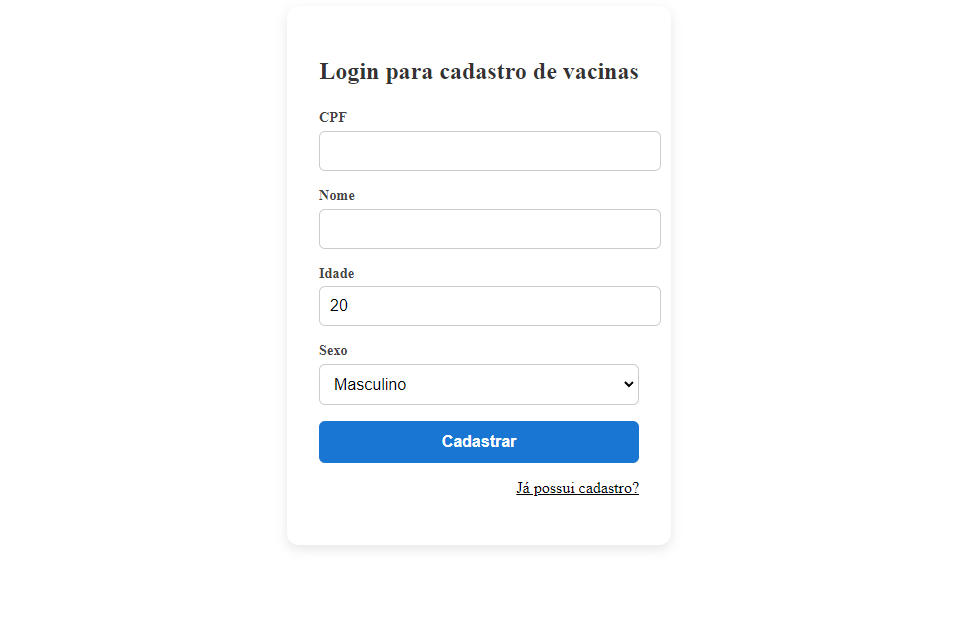
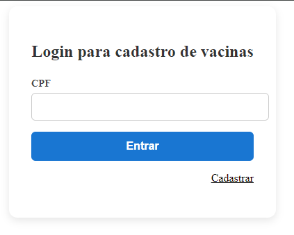
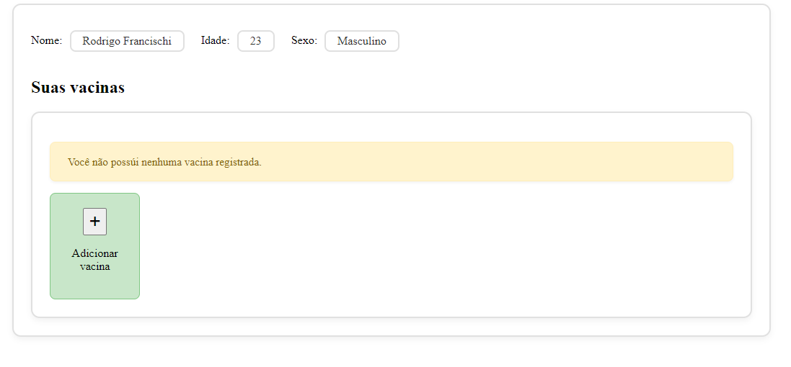
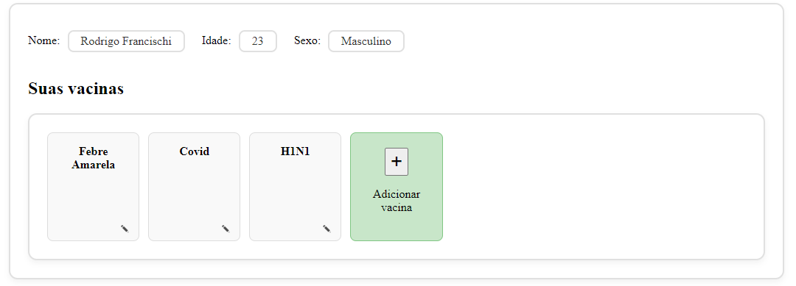
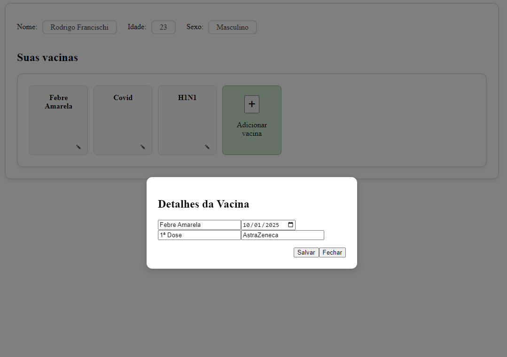
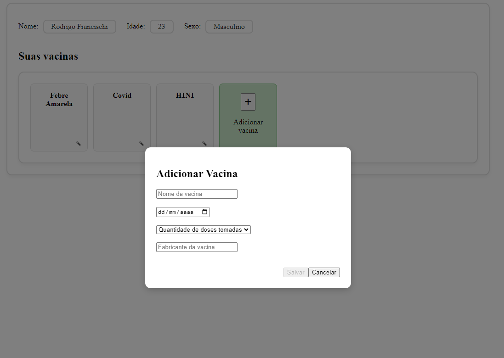
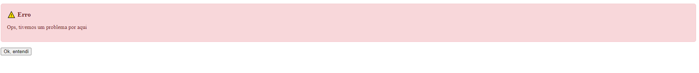

# CartaoVacinacao

Para rodar a aplicação local
- Versão node 20.19+
- Após baixar a aplicacao
- npm i
- npm run build
- npm run start
- *-* Para rodar com mocks, descomentar as linhas (20,33 e 48) do arquivo vacina.service.ts / descomentar as linhas (16 e 28) do arquivo cliente.service.ts
- Caso queira rodar o projeto integrado FED - BFF, basta seguir as instruções do projeto https://github.com/RodrigoQF/cartao-vacinacao-bff

This project was generated using [Angular CLI](https://github.com/angular/angular-cli) version 20.2.1.


Layout tela cadastro


Layout tela de login



Cartão de vacinação caso não possua vacina cadastrada


Cartão de vacinação com vacinas


Informações ao selecionar uma vacina cadastrada


Modal ao editar uma vacina já existente


Adicionar vacina


Tela de exceção


## Development server

To start a local development server, run:

```bash
ng serve
```
Once the server is running, open your browser and navigate to `http://localhost:4200/`. The application will automatically reload whenever you modify any of the source files.

## Code scaffolding

Angular CLI includes powerful code scaffolding tools. To generate a new component, run:

```bash
ng generate component component-name
```

For a complete list of available schematics (such as `components`, `directives`, or `pipes`), run:

```bash
ng generate --help
```

## Building

To build the project run:

```bash
ng build
```

This will compile your project and store the build artifacts in the `dist/` directory. By default, the production build optimizes your application for performance and speed.

## Running unit tests

To execute unit tests with the [Karma](https://karma-runner.github.io) test runner, use the following command:

```bash
ng test
```

## Running end-to-end tests

For end-to-end (e2e) testing, run:

```bash
ng e2e
```

Angular CLI does not come with an end-to-end testing framework by default. You can choose one that suits your needs.

## Additional Resources

For more information on using the Angular CLI, including detailed command references, visit the [Angular CLI Overview and Command Reference](https://angular.dev/tools/cli) page.
